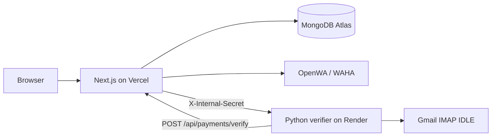

# Duesly deployment blueprint

Duesly is deployed as two services:



## Service ownership

| Service | Platform | Root | Responsibility | Health check |
| --- | --- | --- | --- | --- |
| Next.js app | Vercel | Repository root | UI, auth, API routes, MongoDB, WhatsApp | `/api/health` |
| Python verifier | Render Web Service | `python-verifier` | Gmail IMAP IDLE listener and in-memory FamPay matching | `/health` |

Vercel does not run the Python process. Render does not run the Next.js app. The root `render.yaml` now defines only the Python service.

## Important prerequisite: rotate exposed credentials

The local `.env.local` file contains credentials. It is currently ignored and not tracked by Git, but you should still rotate these values before deploying:

1. Rotate the MongoDB password, Gmail App Password, WhatsApp API key, and auth secret.
2. Keep `.env.local` local-only and never commit it.
3. Use new values in Vercel and Render. Do not paste secrets into source files or commit them.

## Deployment order

### 1. Deploy Next.js to Vercel

In Vercel, import the repository and use:

- Framework preset: `Next.js`
- Root directory: repository root
- Build command: `npm run build`
- Install command: automatic / `npm install`
- Output directory: default

Add these Production environment variables:

| Variable | Required | Value |
| --- | --- | --- |
| `MONGODB_URI` | Yes | MongoDB Atlas connection string |
| `AUTH_SECRET` | Yes | New random secret, at least 32 characters |
| `NEXT_PUBLIC_APP_URL` | Yes | Canonical Vercel URL, no trailing slash |
| `NEXT_PUBLIC_UPI_ID` | Yes | Receiving UPI ID |
| `NEXT_PUBLIC_PAYEE_NAME` | Recommended | Payee name shown in payment UI |
| `OPENWA_URL` | If WhatsApp is used | OpenWA / WAHA base URL |
| `OPENWA_API_KEY` | If WhatsApp is used | OpenWA / WAHA API key |
| `OPENWA_SESSION_ID` | If WhatsApp is used | WhatsApp session ID |
| `PYTHON_VERIFIER_URL` | After Render deploy | Render verifier URL, no trailing slash |
| `VERIFIER_SHARED_SECRET` | Yes | Same random secret configured on Render |

`FAMPAY_GMAIL` and `FAMPAY_GMAIL_APP_PASSWORD` belong only on Render. Do not add them to Vercel.

Deploy once to obtain the canonical Vercel URL. The verifier URL can be filled after step 2; the app may show verifier errors until then, but the Next.js build does not require the Python service.

### 2. Deploy only the verifier to Render

Use **New + -> Blueprint**, select this repository, and apply the root `render.yaml`. It creates one service named `suedue-verifier`:

- Runtime: Python
- Root directory: `python-verifier`
- Build command: `pip install -r requirements.txt`
- Start command: `uvicorn main:app --host 0.0.0.0 --port $PORT`
- Health check: `/health`
- Plan: Starter recommended for a continuously connected IMAP listener

Set these Render environment variables:

| Variable | Required | Value |
| --- | --- | --- |
| `FAMPAY_GMAIL` | Yes | Gmail inbox receiving FamPay receipts |
| `FAMPAY_GMAIL_APP_PASSWORD` | Yes | Google App Password, not the Gmail login password |
| `NEXT_PUBLIC_APP_URL` | Yes | Vercel production URL, no trailing slash |
| `VERIFIER_SHARED_SECRET` | Yes | Exactly the same value as Vercel |
| `PYTHON_VERSION` | No | `3.11.9` |

After Render deploys, copy its public URL into Vercel as `PYTHON_VERIFIER_URL`, then redeploy Vercel. If a custom domain is used, update `NEXT_PUBLIC_APP_URL` on both services to the final canonical URL.

## Smoke tests

Run these after both services are deployed:

```bash
curl -i https://<verifier>.onrender.com/health
curl -i https://<vercel-app>/api/health
curl -i -X POST https://<verifier>.onrender.com/verify-batch \
  -H 'Content-Type: application/json' \
  -d '{"requests":[]}'
```

Expected results:

- Both health checks return `200`.
- The direct unauthenticated verifier request returns `401`.
- The Vercel dashboard payment sync or public payment page can trigger verification successfully.
- Render logs show Gmail IMAP login and an active listener.

## Production risks and decisions

- The verifier cache is in RAM. A Render restart clears it, then the service rebuilds the cache from recent Gmail messages. It is not a durable payment ledger; MongoDB remains the source of truth.
- Render Free can sleep or restart, which is unsuitable for reliable IMAP IDLE. Use Starter or another always-on plan.
- MongoDB Atlas must allow Vercel's dynamic outbound IPs. Use the narrowest practical network policy supported by your Atlas plan; `0.0.0.0/0` is functional but broad.
- The shared secret protects Python verification endpoints from arbitrary public callers. `/health` remains public so Render can probe it.
- `POST /api/payments/verify` is intentionally callable by the public payment page, so it should be rate-limited or redesigned around a payment-token-scoped verification request before treating it as a hardened public API.
- OpenWA remains an independent dependency. WhatsApp sending can fail even when Vercel, Render, MongoDB, and Gmail are healthy.

## Local development

Keep a local-only `env.local` with:

```dotenv
PYTHON_VERIFIER_URL=http://127.0.0.1:8000
VERIFIER_SHARED_SECRET=local-development-secret
NEXT_PUBLIC_APP_URL=http://localhost:3000
```

Start the verifier from `python-verifier` and the Next.js app from the repository root. The same shared secret must be present in both local processes.
